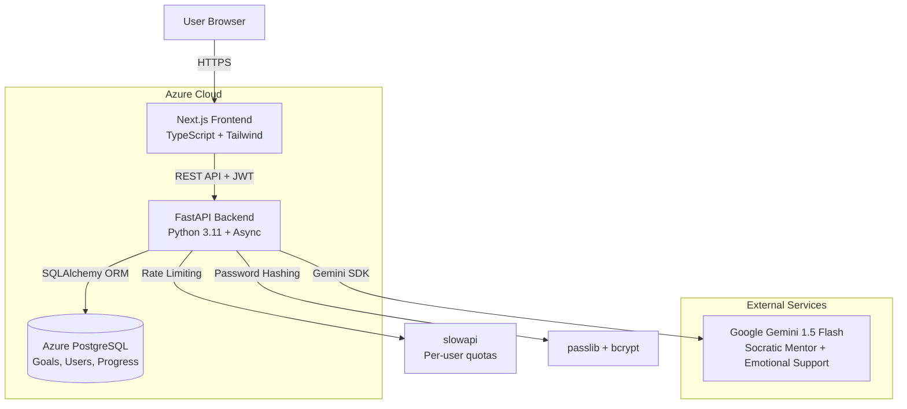

# Apollo Architecture Document

**Project Name:** Apollo
**Date:** 2025-12-14
**Architecture Version:** 1.0
**Competition:** Microsoft Imagine Cup 2025
**Deadline:** December 28, 2025

---

## Introduction

This document outlines the overall project architecture for Apollo, including backend systems, shared services, and non-UI specific concerns. Its primary goal is to serve as the guiding architectural blueprint for AI-driven development, ensuring consistency and adherence to chosen patterns and technologies.

**Relationship to Frontend Architecture:**
If the project includes a significant user interface, a separate Frontend Architecture Document will detail the frontend-specific design and MUST be used in conjunction with this document. Core technology stack choices documented herein (see "Tech Stack") are definitive for the entire project, including any frontend components.

### Starter Template or Existing Project

**Decision:** N/A - No starter templates. Building custom Next.js and FastAPI applications from scratch with monorepo structure.

### Change Log

| Date | Version | Description | Author |
|------|---------|-------------|--------|
| 2025-12-14 | 1.0 | Initial architecture document creation | Winston (Architect) |

---

## High Level Architecture

### Technical Summary

Apollo is a **modular monolith** backend architecture with a **Next.js SSR frontend**, designed for rapid development and cost efficiency. The system leverages **Google Gemini 1.5 Flash** for dual AI personas (Socratic Mentor and Emotional Support), with **PostgreSQL** for relational data storage and **FastAPI** providing a RESTful API layer. The architecture emphasizes **async Python patterns** for concurrent LLM API calls, **SQLAlchemy ORM** with Pydantic for type-safe database access, and **JWT-based authentication** for simplicity. Deployment targets **Azure App Service** with a single-instance monolith to minimize costs and complexity, aligning with the 24-day competition timeline and zero-budget constraint using free tiers.

### High Level Overview

**Architectural Style:** Modular Monolith (single deployable backend application with clear internal module boundaries)

**Repository Structure:** Monorepo with `/frontend` (Next.js + TypeScript) and `/backend` (FastAPI + Python) in a single Git repository

**Service Architecture:** Single FastAPI application with router-based modules:
- `auth` - User authentication and session management
- `goals` - Goal creation, action steps, progress tracking
- `ai` - LLM integration, Socratic Mentor, Emotional Support AI
- `community` - Forums, posts, replies (Epic 5 - optional)
- `notes` - Note-taking functionality (Epic 5 - optional)

**Primary User Interaction Flow:**
1. User authenticates → receives JWT token
2. Creates goal → AI generates Harada-style plan → persisted to PostgreSQL
3. Interacts with AI Mentor via chat → Gemini API processes Socratic responses
4. Completes action steps → streak calculation → progress updates
5. (Optional) Participates in goal-based forums

**Key Architectural Decisions:**
- **Monolith over Microservices:** Simpler deployment, single database, faster development for 3-person team
- **Async FastAPI:** Non-blocking I/O for concurrent LLM API calls (NFR1: <3s response time)
- **SQLAlchemy + Alembic:** Type-safe ORM with migration support for evolving schema
- **JWT Auth (DIY):** Avoids Azure AD B2C setup complexity, sufficient security for MVP
- **Gemini Free Tier:** Zero cost, 1500 req/day quota requires strict per-user rate limiting

### High Level Project Diagram



### Architectural and Design Patterns

**Selected Patterns:**

- **Modular Monolith:** All backend logic in one FastAPI app with router-based modules (auth, goals, ai, community, notes). *Rationale:* Eliminates microservices complexity (service discovery, inter-service communication), reduces hosting costs to single Azure App Service instance, simplifies debugging for 3-developer team, allows future service extraction if specific modules need independent scaling.

- **Repository Pattern:** Abstract database access behind repository classes (e.g., `GoalRepository`, `UserRepository`). *Rationale:* Enables unit testing with mock repositories, decouples business logic from SQLAlchemy implementation, provides flexibility for future database migration if needed.

- **Async/Await (FastAPI):** All API endpoints use Python async/await for non-blocking I/O. *Rationale:* Critical for NFR1 (<3s AI response time) - allows server to handle multiple concurrent Gemini API calls without blocking, prevents thread pool exhaustion under load.

- **Dependency Injection (FastAPI):** Use FastAPI's `Depends()` for injecting database sessions, authentication, rate limiters. *Rationale:* Improves testability (inject mock dependencies), enforces separation of concerns, built into FastAPI framework.

- **RESTful API:** Standard HTTP methods (GET, POST, PATCH, DELETE) with resource-based URLs. *Rationale:* Simple, well-understood pattern for frontend-backend communication, auto-generated OpenAPI docs via FastAPI, no GraphQL complexity needed for MVP scope.

- **JWT Token Authentication:** Stateless authentication with short-lived access tokens (24-hour expiry). *Rationale:* No session storage needed (scales horizontally), simple implementation with python-jose, avoids Azure AD B2C setup time (~4-6 hours), sufficient security for competition timeline.

- **Prompt Template Pattern:** Versioned system prompts stored as Python string templates in codebase (not database). *Rationale:* Enables Git version control of AI behavior, faster iteration during development, easier testing of prompt variations, no database round-trip for every LLM call.

---

## Tech Stack

### Cloud Infrastructure

- **Provider:** Microsoft Azure
- **Key Services:** Azure App Service (Python runtime for FastAPI backend), Azure Static Web Apps or App Service (for Next.js frontend), Supabase for PostgreSQL (external managed service)
- **Deployment Regions:** Single region deployment (recommend East US or West Europe for latency to competition judges)

### Technology Stack Table

| Category | Technology | Version | Purpose | Rationale |
|----------|------------|---------|---------|-----------|
| **Language** | TypeScript | 5.3.3 | Frontend development language | Strong typing prevents runtime errors, excellent IDE support, team expertise assumed, aligns with Next.js best practices |
| **Language** | Python | 3.11.0 | Backend development language | Modern async/await support critical for concurrent Gemini API calls, type hints with Pydantic, fast development cycle for 24-day timeline |
| **Frontend Framework** | Next.js | 14.2.0 | React framework with SSR/SSG | App Router provides file-based routing, built-in API routes (unused but available), SSR for SEO, image optimization, production-ready defaults |
| **UI Library** | React | 18.3.0 | Component-based UI library | Industry standard, massive ecosystem, Next.js dependency, team familiarity assumed |
| **Styling** | Tailwind CSS | 3.4.0 | Utility-first CSS framework | Rapid UI development without custom CSS files, responsive design utilities, smaller bundle size than component libraries, no design system needed |
| **UI Components** | Radix UI | 1.0.0 | Headless accessible primitives | WCAG AA compliance accelerator (modals, dropdowns, dialogs), unstyled components work with Tailwind, reduces custom accessibility code |
| **Form Handling** | React Hook Form | 7.51.0 | Form state management | Performant uncontrolled components, minimal re-renders, integrates with Zod validation |
| **Validation** | Zod | 3.22.0 | TypeScript-first schema validation | Type-safe form validation, shared schemas between client/server possible, better DX than Yup |
| **Markdown** | react-markdown | 9.0.0 | Markdown rendering for notes | Renders user markdown notes safely, extensible with plugins, prevents XSS attacks |
| **State Management** | React Context API | 18.3.0 (built-in) | Global state (auth, current goal) | Sufficient for MVP scope, no Redux complexity, built into React, good for authentication state |
| **Backend Framework** | FastAPI | 0.110.0 | Python API framework | Auto-generated OpenAPI docs, excellent async support, Pydantic integration, fast development, best-in-class Python API framework |
| **ASGI Server** | Uvicorn | 0.28.0 | ASGI server for FastAPI | Production-ready async server, required for FastAPI async endpoints, supports WebSockets if needed later |
| **ORM** | SQLAlchemy | 2.0.28 | Database ORM with async support | Mature ecosystem, async engine for non-blocking DB queries, type-safe with Pydantic models, Alembic migration support |
| **Migrations** | Alembic | 1.13.0 | Database schema migrations | Official SQLAlchemy migration tool, version control for schema, auto-generate migrations from model changes |
| **Validation** | Pydantic | 2.6.0 | Request/response validation | FastAPI native validation, automatic type coercion, excellent error messages, matches TypeScript type safety on backend |
| **Authentication** | python-jose | 3.3.0 | JWT token generation/validation | Simple JWT implementation, HS256 signing, no external auth service needed, sufficient security for MVP |
| **Password Hashing** | passlib | 1.7.4 | Password hashing with bcrypt | Industry-standard bcrypt hashing, slow hash function prevents brute force, automatic salt generation |
| **Rate Limiting** | slowapi | 0.1.9 | API rate limiting | Prevents Gemini quota abuse, per-user limits, simple decorator-based API, protects against DoS |
| **Profanity Filter** | better-profanity | 0.7.0 | Content moderation for forums | Basic profanity detection for Epic 5, lightweight, customizable word list, prevents obvious abuse |
| **Database** | PostgreSQL | 15.0 | Primary relational database | ACID compliance, JSONB for flexible goal structures if needed, robust for relational data (users, goals, steps), Supabase free tier available |
| **Database Hosting** | Supabase | Cloud (free tier) | Managed PostgreSQL hosting | $0 cost for MVP, built-in connection pooling, dashboard for manual queries, faster setup than Azure PostgreSQL, includes auth (unused) and storage (future) |
| **AI/LLM** | Google Gemini 1.5 Flash | 1.5 (via API) | Socratic Mentor and Emotional Support AI | Free tier (1500 req/day), fast response times, good instruction-following for Socratic prompts, zero cost critical for budget |
| **LLM SDK** | google-generativeai | 0.4.0 | Python SDK for Gemini API | Official Google SDK, async support, streaming responses available, error handling built-in |
| **Code Quality (Frontend)** | ESLint | 8.57.0 | JavaScript/TypeScript linter | Catches bugs before runtime, enforces code style, Next.js config built-in |
| **Code Quality (Frontend)** | Prettier | 3.2.0 | Code formatter | Consistent formatting, auto-format on save, eliminates style debates |
| **Code Quality (Backend)** | Ruff | 0.3.0 | Fast Python linter | Replaces Flake8/isort/pyupgrade, 10-100x faster, same rules as Flake8, growing adoption |
| **Code Quality (Backend)** | Black | 24.2.0 | Python code formatter | Uncompromising formatter, eliminates formatting debates, PEP 8 compliant |
| **Code Quality (Backend)** | mypy | 1.9.0 | Static type checker | Enforces type hints, catches type errors at dev time, aligns with Pydantic/SQLAlchemy types |
| **Testing (Frontend)** | Jest | 29.7.0 | JavaScript testing framework | Next.js default, fast, snapshot testing, mocking built-in |
| **Testing (Frontend)** | React Testing Library | 14.2.0 | React component testing | Tests user behavior not implementation, accessibility-first, simpler than Enzyme |
| **Testing (Backend)** | pytest | 8.1.0 | Python testing framework | Industry standard, fixture system, parametrize for data-driven tests, FastAPI TestClient integration |
| **Testing (Backend)** | pytest-asyncio | 0.23.0 | Async test support for pytest | Required for testing async FastAPI endpoints, marks async test functions |
| **Environment Management** | dotenv (Python) | 1.0.0 | Environment variable loading | Simple .env file support, secrets management for local dev |
| **Environment Management** | pydantic-settings | 2.2.0 | Type-safe settings management | Validates env vars at startup, type coercion, better than os.getenv() |
| **Deployment** | Azure App Service | N/A (PaaS) | Hosting for FastAPI backend | Python runtime support, auto-scaling, covered by credits, simple deployment |
| **Deployment** | Azure Static Web Apps or Vercel | N/A (PaaS) | Hosting for Next.js frontend | Next.js optimized, global CDN, automatic HTTPS, Vercel has better Next.js support if Azure credits allow |
| **Version Control** | Git | 2.40+ | Source control | Industry standard, required for GitHub Actions later |
| **Repository Hosting** | GitHub | N/A | Code hosting and collaboration | Free for public repos, GitHub Actions available, competition submission likely via GitHub |
| **Package Manager (Frontend)** | npm | 10.2.0 | Node.js package manager | Comes with Node.js, lockfile support, widely used |
| **Package Manager (Backend)** | pip | 24.0 | Python package manager | Standard Python package installer, requirements.txt for dependencies |
| **Virtual Environment** | venv | 3.11 (built-in) | Python virtual environment | Isolates Python dependencies, no external tool needed, built into Python 3.11 |

---

## Data Models

### User

**Purpose:** Represents authenticated users who create goals, track progress, and participate in community features.

**Key Attributes:**
- `id`: UUID - Unique identifier for the user
- `email`: String (unique, max 255 chars) - User's email address for authentication
- `password_hash`: String (60 chars for bcrypt) - Hashed password using passlib + bcrypt
- `current_streak`: Integer (default 0) - Number of consecutive days with completed actions
- `longest_streak`: Integer (default 0) - Historical record of longest streak achieved
- `last_active_date`: Date (nullable) - Last date user completed any action (for streak calculation)
- `created_at`: DateTime - Account creation timestamp
- `updated_at`: DateTime - Last account update timestamp

**Relationships:**
- One-to-many with `Goal` (user has multiple goals)
- One-to-many with `UserProgress` (daily progress records)
- One-to-many with `ChatMessage` (conversation history)
- One-to-many with `ForumPost` (Epic 5 - community participation)
- One-to-many with `ForumReply` (Epic 5 - community participation)
- One-to-many with `Note` (Epic 5 - personal knowledge capture)

### Goal

**Purpose:** Represents a user's high-level goal with AI-generated Harada-style structure (sub-goals and action steps).

**Key Attributes:**
- `id`: UUID - Unique identifier
- `user_id`: UUID (ForeignKey to User) - Owner of the goal
- `title`: String (max 100 chars) - Goal title (e.g., "Learn Python")
- `description`: Text - Detailed goal description provided by user
- `status`: Enum (active, completed, archived) - Goal lifecycle state
- `forum_id`: UUID (nullable, ForeignKey to Forum) - Linked community forum (Epic 5)
- `created_at`: DateTime - Goal creation timestamp
- `updated_at`: DateTime - Last modification timestamp

**Relationships:**
- Many-to-one with `User` (goal belongs to one user)
- One-to-many with `SubGoal` (goal contains 2-4 sub-goals)
- One-to-many with `ChatMessage` (AI conversations scoped to goal)
- One-to-many with `Note` (Epic 5 - notes linked to specific goals)

### SubGoal

**Purpose:** Intermediate-level breakdown of a Goal, representing major milestones in the Harada Method structure.

**Key Attributes:**
- `id`: UUID - Unique identifier
- `goal_id`: UUID (ForeignKey to Goal) - Parent goal
- `title`: String (max 200 chars) - Sub-goal title (e.g., "Master Python basics")
- `order`: Integer - Sequencing for display (1, 2, 3...)
- `created_at`: DateTime - Creation timestamp
- `updated_at`: DateTime - Last modification timestamp

**Relationships:**
- Many-to-one with `Goal` (sub-goal belongs to one goal)
- One-to-many with `ActionStep` (sub-goal contains 3-6 action steps)

### ActionStep

**Purpose:** Concrete, actionable tasks within a sub-goal. These are the daily work items users complete to make progress.

**Key Attributes:**
- `id`: UUID - Unique identifier
- `sub_goal_id`: UUID (ForeignKey to SubGoal) - Parent sub-goal
- `title`: String (max 200 chars) - Action step title
- `description`: Text - Detailed description of what to do
- `status`: Enum (pending, in_progress, completed) - Action step state
- `order`: Integer - Sequencing within sub-goal
- `estimated_minutes`: Integer - Time estimate (5-30 minutes typical)
- `micro_steps_generated`: Boolean (default False) - Whether scaffolding has been offered (Epic 4)
- `stuck_detected_at`: DateTime (nullable) - When system detected user was stuck (Epic 4)
- `micro_step_exited_at`: DateTime (nullable) - When user exited scaffolding (Epic 4)
- `completed_at`: DateTime (nullable) - Completion timestamp
- `created_at`: DateTime - Creation timestamp
- `updated_at`: DateTime - Last modification timestamp

**Relationships:**
- Many-to-one with `SubGoal`
- One-to-many with `MicroStep` (Epic 4 - scaffolding breakdown)
- One-to-many with `ChatMessage` (AI conversations scoped to specific action step)

### MicroStep (Epic 4 - Optional)

**Purpose:** Ultra-granular 5-10 minute tasks generated when user is genuinely stuck, providing adaptive scaffolding.

**Key Attributes:**
- `id`: UUID - Unique identifier
- `action_step_id`: UUID (ForeignKey to ActionStep) - Parent action step
- `title`: String (max 200 chars) - Micro-step title (very specific task)
- `order`: Integer - Sequencing (1, 2, 3...)
- `status`: Enum (pending, completed) - Micro-step state
- `completed_at`: DateTime (nullable) - Completion timestamp
- `created_at`: DateTime - Creation timestamp

**Relationships:**
- Many-to-one with `ActionStep`

### UserProgress

**Purpose:** Daily aggregated progress tracking for streak calculation and activity monitoring.

**Key Attributes:**
- `id`: UUID - Unique identifier
- `user_id`: UUID (ForeignKey to User) - User who made progress
- `date`: Date - The date of activity (unique constraint with user_id)
- `actions_completed`: Integer (default 0) - Count of action steps completed this day
- `minutes_worked`: Integer (default 0) - Sum of estimated_minutes from completed steps
- `created_at`: DateTime - Record creation timestamp
- `updated_at`: DateTime - Last update timestamp

**Relationships:**
- Many-to-one with `User`

### ChatMessage

**Purpose:** Stores conversation history between user and AI (Socratic Mentor or Emotional Support modes).

**Key Attributes:**
- `id`: UUID - Unique identifier
- `user_id`: UUID (ForeignKey to User) - User in conversation
- `goal_id`: UUID (nullable, ForeignKey to Goal) - Contextual goal being discussed
- `action_step_id`: UUID (nullable, ForeignKey to ActionStep) - Contextual action step being discussed
- `role`: Enum (user, mentor, emotional_support) - Message sender
- `content`: Text - Message content
- `triggered_micro_stepping`: Boolean (default False) - Whether this message led to scaffolding offer (Epic 4)
- `timestamp`: DateTime - Message creation time

**Relationships:**
- Many-to-one with `User`
- Many-to-one with `Goal` (nullable)
- Many-to-one with `ActionStep` (nullable)

### Forum (Epic 5 - Optional)

**Purpose:** Goal-category based communities for peer support.

**Key Attributes:**
- `id`: UUID - Unique identifier
- `title`: String (max 100 chars) - Forum name
- `slug`: String (max 100 chars, unique) - URL-friendly identifier
- `description`: Text - Forum purpose/description
- `created_at`: DateTime - Creation timestamp

**Relationships:**
- One-to-many with `ForumPost`
- One-to-many with `Goal`

### ForumPost (Epic 5 - Optional)

**Purpose:** User-created posts within forums for questions, progress updates, peer support.

**Key Attributes:**
- `id`: UUID - Unique identifier
- `forum_id`: UUID (ForeignKey to Forum) - Parent forum
- `user_id`: UUID (ForeignKey to User) - Post author
- `title`: String (max 200 chars) - Post title
- `content`: Text - Post body (markdown supported)
- `upvotes`: Integer (default 0) - Community upvote count
- `created_at`: DateTime - Post creation timestamp
- `updated_at`: DateTime - Last edit timestamp

**Relationships:**
- Many-to-one with `Forum`
- Many-to-one with `User`
- One-to-many with `ForumReply`

### ForumReply (Epic 5 - Optional)

**Purpose:** Replies to forum posts, enabling threaded discussions.

**Key Attributes:**
- `id`: UUID - Unique identifier
- `post_id`: UUID (ForeignKey to ForumPost) - Parent post
- `user_id`: UUID (ForeignKey to User) - Reply author
- `content`: Text - Reply content (markdown supported)
- `created_at`: DateTime - Reply timestamp

**Relationships:**
- Many-to-one with `ForumPost`
- Many-to-one with `User`

### Note (Epic 5 - Optional)

**Purpose:** Private user notes for capturing insights, reflections, and resources while working on goals.

**Key Attributes:**
- `id`: UUID - Unique identifier
- `user_id`: UUID (ForeignKey to User) - Note owner
- `goal_id`: UUID (ForeignKey to Goal) - Associated goal
- `content`: Text - Note content (markdown format)
- `created_at`: DateTime - Creation timestamp
- `updated_at`: DateTime - Last edit timestamp

**Relationships:**
- Many-to-one with `User`
- Many-to-one with `Goal`

---

## Components

### Authentication Service

**Responsibility:** Handle user registration, login, JWT token generation/validation, and session management.

**Key Interfaces:**
- `POST /api/auth/register` - Create new user account
- `POST /api/auth/login` - Authenticate and return JWT token
- `GET /api/auth/me` - Validate JWT and return user profile
- `POST /api/auth/logout` - Client-side token removal

**Dependencies:** Database (User model), passlib + bcrypt, python-jose

**Technology Stack:** FastAPI router (`routers/auth.py`), Pydantic models, JWT with 24-hour expiry

### Goal Management Service

**Responsibility:** CRUD operations for goals, sub-goals, and action steps. Orchestrates AI-powered goal plan generation.

**Key Interfaces:**
- `POST /api/goals` - Create goal with AI-generated plan
- `GET /api/goals` - List all user goals with progress
- `GET /api/goals/:goalId` - Retrieve full goal structure
- `PATCH /api/goals/:goalId` - Update goal
- `DELETE /api/goals/:goalId` - Delete goal (cascade)
- `PATCH /api/action-steps/:stepId` - Update action step
- `DELETE /api/action-steps/:stepId` - Delete action step
- `POST /api/action-steps/:stepId/complete` - Mark completed
- `POST /api/action-steps/:stepId/uncomplete` - Revert to pending

**Dependencies:** Database (Goal, SubGoal, ActionStep models), AI Service, Progress Tracking Service

**Technology Stack:** FastAPI router (`routers/goals.py`), Repository pattern, Pydantic schemas, async SQLAlchemy

### AI Service

**Responsibility:** Integration with Google Gemini API for dual AI personas, prompt management, response validation.

**Key Interfaces:**
- `POST /api/chat` - Send message, receive AI response
- Internal: `generateGoalPlan()`, `socraticMentor()`, `emotionalSupport()`, `detectFrustration()`, `generateMicroSteps()`

**Dependencies:** Gemini API, Database (ChatMessage), Rate limiting

**Technology Stack:** FastAPI router (`routers/ai.py`), Service layer (`ai_service.py`), Prompt templates in `prompts/`, async Gemini SDK

### Progress Tracking Service

**Responsibility:** Manage daily progress, streak calculation, action step completion events.

**Key Interfaces:**
- Internal: `recordCompletion()`, `calculateStreak()`
- `GET /api/progress/streak` - Retrieve streak data

**Dependencies:** Database (UserProgress, User models), Goal Management Service

**Technology Stack:** Service module (`services/progress_service.py`), atomic transactions for streak updates

### Community Service (Epic 5 - Optional)

**Responsibility:** Forum management, posts, replies, upvotes, auto-forum creation.

**Key Interfaces:**
- `GET /api/forums` - List all forums
- `POST /api/forums` - Create forum (admin/system)
- `GET /api/forums/:slug/posts` - List posts
- `POST /api/forums/:slug/posts` - Create post
- `POST /api/posts/:postId/upvote` - Increment upvotes
- `GET /api/posts/:postId/replies` - Get replies
- `POST /api/posts/:postId/replies` - Create reply

**Dependencies:** Database (Forum, ForumPost, ForumReply), better-profanity, AI Service (categorization)

**Technology Stack:** FastAPI router (`routers/community.py`), profanity filter middleware, polling-based updates (no WebSockets)

### Notes Service (Epic 5 - Optional)

**Responsibility:** Personal note-taking for goal-specific reflections.

**Key Interfaces:**
- `POST /api/goals/:goalId/notes` - Create note
- `GET /api/goals/:goalId/notes` - List notes
- `PATCH /api/notes/:noteId` - Update note
- `DELETE /api/notes/:noteId` - Delete note

**Dependencies:** Database (Note model), Authentication

**Technology Stack:** FastAPI router (`routers/notes.py`), markdown stored as text, frontend renders with react-markdown

### Frontend Application (Next.js)

**Responsibility:** User interface, client-side routing, state management, API consumption, responsive design.

**Key Interfaces:**
- Pages: `/signup`, `/login`, `/dashboard`, `/goals/new`, `/goals/[goalId]`, `/forums`, etc.
- Components: `GoalCard`, `ActionStepList`, `ChatInterface`, `StreakDisplay`
- API Client: `lib/api.ts` with typed fetch wrappers

**Dependencies:** Backend API, React Context (auth), localStorage (JWT tokens)

**Technology Stack:** Next.js 14 App Router, TypeScript strict mode, Tailwind CSS, Radix UI, React Hook Form + Zod

---

## External APIs

### Google Gemini API

- **Purpose:** Power dual AI personas, generate goal plans, categorize goals, detect frustration, generate micro-steps
- **Documentation:** https://ai.google.dev/docs
- **Base URL(s):** `https://generativelanguage.googleapis.com/v1beta/` (SDK handles endpoints)
- **Authentication:** API Key via `GEMINI_API_KEY` environment variable
- **Rate Limits:**
  - Gemini 1.5 Flash (free): 15 RPM, 1M TPM, **1500 requests/day**
  - Gemini 1.5 Pro (fallback): 2 RPM, 32K TPM, 50 requests/day

**Key Endpoints Used:**
- `POST /models/gemini-1.5-flash:generateContent` - Primary endpoint for all AI interactions

**Integration Notes:**
- **Quota Management:** Per-user rate limit (20 msg/day) enforced via slowapi, monitor at 80% (1200/1500)
- **Retry Policy:** Single retry with 2s exponential backoff for transient failures
- **Timeout:** 10-second timeout on all API calls
- **Error Translation:** 429 → 503 "AI service busy", timeout → 504 "AI service timeout"

---

## Core Workflows

See architecture document for detailed sequence diagrams covering:
1. User Registration and Authentication
2. AI-Powered Goal Creation
3. Socratic Mentor Chat with Context Switching
4. Action Step Completion and Streak Update
5. Stuck Detection and Micro-Stepping (Epic 4)

---

## REST API Spec

Full OpenAPI 3.0 specification available in document. Key endpoints:

**Authentication:**
- `POST /api/auth/register` - User registration
- `POST /api/auth/login` - User login
- `GET /api/auth/me` - Get current user

**Goals:**
- `GET /api/goals` - List user goals
- `POST /api/goals` - Create goal with AI plan
- `GET /api/goals/:goalId` - Get goal details
- `PATCH /api/goals/:goalId` - Update goal
- `DELETE /api/goals/:goalId` - Delete goal

**Action Steps:**
- `PATCH /api/action-steps/:stepId` - Update step
- `POST /api/action-steps/:stepId/complete` - Mark complete
- `POST /api/action-steps/:stepId/uncomplete` - Revert completion

**AI Chat:**
- `POST /api/chat` - Send message to AI mentor (rate limited: 20/day)

**Progress:**
- `GET /api/progress/streak` - Get streak data

**Community (Epic 5):**
- `GET /api/forums` - List forums
- `POST /api/forums/:slug/posts` - Create post
- `POST /api/posts/:postId/upvote` - Upvote post

---

## Database Schema

PostgreSQL 15.0 schema with SQLAlchemy 2.0 models. Key tables:

- `users` - User accounts with streak tracking
- `goals` - User goals with status
- `sub_goals` - Goal breakdowns (ordered)
- `action_steps` - Concrete tasks with completion tracking
- `micro_steps` - Scaffolding tasks (Epic 4)
- `user_progress` - Daily aggregated progress (unique constraint on user_id + date)
- `chat_messages` - AI conversation history
- `forums`, `forum_posts`, `forum_replies` - Community (Epic 5)
- `notes` - Personal notes (Epic 5)

**Schema Features:**
- UUID primary keys
- PostgreSQL enums for status fields
- Cascade deletes for referential integrity
- Indexes on foreign keys and frequently queried fields
- Triggers for automatic `updated_at` timestamps

---

## Source Tree

```
apollo/
├── backend/                            # FastAPI Python backend
│   ├── alembic/                        # Database migrations
│   ├── app/
│   │   ├── core/                       # Config, database, security
│   │   ├── models/                     # SQLAlchemy ORM models
│   │   ├── schemas/                    # Pydantic request/response schemas
│   │   ├── repositories/               # Repository pattern for data access
│   │   ├── services/                   # Business logic layer
│   │   ├── prompts/                    # Gemini system prompts (versioned)
│   │   ├── routers/                    # FastAPI route handlers
│   │   ├── dependencies.py             # FastAPI dependencies
│   │   └── main.py                     # App entry point
│   └── tests/                          # Backend tests
│
├── frontend/                           # Next.js TypeScript frontend
│   ├── app/                            # Next.js 14 App Router
│   │   ├── (auth)/                     # Auth route group
│   │   ├── dashboard/
│   │   ├── goals/
│   │   └── forums/
│   ├── components/                     # React components
│   │   ├── ui/                         # Base UI (Radix + Tailwind)
│   │   ├── goals/
│   │   ├── chat/
│   │   └── progress/
│   ├── lib/                            # API client, utilities
│   ├── contexts/                       # React Context providers
│   └── types/                          # TypeScript definitions
│
└── docs/                               # Documentation
    ├── prd.md
    └── architecture.md
```

---

## Infrastructure and Deployment

### Infrastructure as Code

- **Tool:** Manual Azure Portal setup for MVP
- **Approach:** Click-ops deployment, migrate to IaC post-competition

### Deployment Strategy

- **Strategy:** Blue-Green via Azure deployment slots (frontend), direct deployment (backend)
- **CI/CD Platform:** Manual for MVP, GitHub Actions optional post-Epic 3
- **Pipeline:** Manual deployment checklist in `docs/deployment-guide.md`

### Environments

- **Development:** Local (localhost, local PostgreSQL or Supabase connection)
- **Production:** Azure App Service (backend), Azure Static Web Apps or Vercel (frontend), Supabase PostgreSQL

### Rollback Strategy

- **Primary Method:** Azure deployment slot swap (instant) or Git revert + redeploy
- **Trigger Conditions:** Critical bugs, database connection failures, AI service broken
- **Recovery Time Objective:** <5 minutes (slot swap), <15 minutes (Git revert)

---

## Error Handling Strategy

### General Approach

- **Error Model:** FastAPI HTTPException, Pydantic ValidationError, custom domain exceptions
- **Exception Hierarchy:** Base `ApolloException` → specific exceptions (InvalidCredentials, GeminiRateLimitException, etc.)
- **Error Propagation:** Services → routers → FastAPI handlers → HTTP response

### Logging Standards

- **Library:** Python built-in `logging` module
- **Format:** JSON structured logs (production), plain text (dev)
- **Levels:** DEBUG (dev), INFO (flow), WARNING (recoverable), ERROR (failures), CRITICAL (system-wide)
- **Required Context:** `request_id` (correlation), `service`, `user_id` (never log email/PII)

### Error Handling Patterns

**External API Errors:**
- **Retry:** Single retry with 2s exponential backoff for transient failures
- **Circuit Breaker:** None for MVP
- **Timeout:** 10s on all Gemini API calls
- **Error Translation:** Gemini 429 → Apollo 503, timeout → 504

**Business Logic Errors:**
- Custom exceptions with clear user-facing messages
- 404 for not found, 403 for unauthorized, 400 for invalid state

**Data Consistency:**
- SQLAlchemy async transactions with explicit BEGIN/COMMIT/ROLLBACK
- Idempotent action step completion (check status before updating)

---

## Coding Standards

**MANDATORY - AI developers must follow:**

- **Never use `print()` or `console.log()` in production** - Use `logger.info()` (Python) or proper logging
- **All API responses use Pydantic schemas** - Never return raw SQLAlchemy models
- **Database queries use repositories** - Never call `db.query()` directly in routers
- **No hardcoded secrets** - All from environment variables via `settings`
- **Frontend API calls use API client** - Never `fetch()` directly in components
- **All async functions handle errors** - Never `async/await` without try/catch in services
- **TypeScript strict mode** - No `@ts-ignore` or `as any` except documented exceptions
- **Component props must be typed** - All React components require TypeScript interface
- **SQL injection prevention** - Always use SQLAlchemy parameterized queries
- **Rate limiting on AI endpoints** - Every Gemini-calling endpoint has `@limiter.limit("20/day")`
- **Validate all external input** - All POST/PATCH bodies have Pydantic validation

### Naming Conventions

| Element | Convention | Example |
|---------|-----------|---------|
| Python functions | snake_case | `calculate_streak()` |
| Python classes | PascalCase | `UserRepository` |
| TypeScript functions | camelCase | `fetchGoals()` |
| TypeScript components | PascalCase | `GoalCard` |
| Database tables | snake_case plural | `users`, `action_steps` |
| API endpoints | kebab-case | `/api/action-steps/:id` |

---

## Test Strategy

### Testing Philosophy

- **Approach:** Test-after development (not strict TDD)
- **Coverage Goals:** 60%+ on services/repositories, all critical API endpoints
- **Test Pyramid:** 60% unit, 30% integration, 10% manual

### Test Types

**Unit Tests:**
- **Framework:** pytest 8.1.0, pytest-asyncio 0.23.0
- **Location:** `backend/tests/unit/`
- **Coverage:** 60%+ on business logic
- **Requirements:** AAA pattern, mock all external dependencies

**Integration Tests:**
- **Scope:** API endpoints with test database (SQLite in-memory or Supabase test project)
- **Location:** `backend/tests/integration/`
- **Infrastructure:** FastAPI TestClient, mocked Gemini API

**E2E Tests:**
- None for MVP - manual testing checklist before deployment

### Test Data Management

- **Strategy:** Factory pattern with Faker library
- **Fixtures:** pytest fixtures in `tests/conftest.py`
- **Cleanup:** Automatic via test database teardown

---

## Security

### Input Validation

- **Library:** Pydantic (backend), Zod (frontend)
- **Location:** All POST/PATCH endpoints validate at API boundary
- **Rules:** Whitelist approach, never trust frontend validation alone

### Authentication & Authorization

- **Auth Method:** JWT with HS256 signing, 24-hour expiry
- **Session Management:** Stateless JWT in localStorage (no refresh tokens)
- **Required Patterns:** All protected endpoints use `get_current_user`, verify `resource.user_id == current_user.id`

### Secrets Management

- **Development:** `.env` file (gitignored) with pydantic-settings
- **Production:** Azure App Service environment variables
- **Requirements:** Never hardcode secrets, access via `settings`, never log secrets

### API Security

- **Rate Limiting:** slowapi per-user quotas (20 msg/day on chat, 50/day on goal creation)
- **CORS:** Production frontend URLs only, no wildcard
- **Security Headers:** X-Content-Type-Options, X-Frame-Options, X-XSS-Protection, HSTS
- **HTTPS:** All production traffic TLS 1.3, HTTP → HTTPS redirect

### Data Protection

- **Encryption at Rest:** Azure/Supabase automatic AES-256
- **Encryption in Transit:** HTTPS (TLS 1.3), database SSL/TLS
- **PII Handling:** Email only, never log emails in production, GDPR endpoints (data export, account deletion)
- **Logging Restrictions:** Never log passwords, JWT tokens, API keys, emails

### Dependency Security

- **Scanning:** `pip-audit` (Python), `npm audit` (Node.js)
- **Update Policy:** Critical (CVSS 9.0+) immediate, High (7.0-8.9) within 7 days
- **Process:** Team lead reviews new dependencies in PR

---

## Checklist Results Report

**Overall Architecture Readiness:** ✅ **HIGH** - Ready for development

**Pass Rate:** 95% (42/44 items)

**Critical Risks:**
1. Gemini API quota management (mitigated via rate limiting)
2. No staging environment (acceptable for 24-day timeline)
3. Manual deployment (documented process, rollback via slots)

**Recommendations:**
- Create separate Frontend Architecture document (4-6 hours)
- Implement Gemini quota monitoring script (1 hour)

**AI Implementation Readiness:** ✅ Excellent - clear patterns, repository pattern mandatory, type-safe schemas

---

## Next Steps

### Frontend Architect Prompt

Use the PRD "Architect Prompt" to create `docs/frontend-architecture.md` document that references this backend architecture for API integration patterns.

---

**End of Architecture Document**
